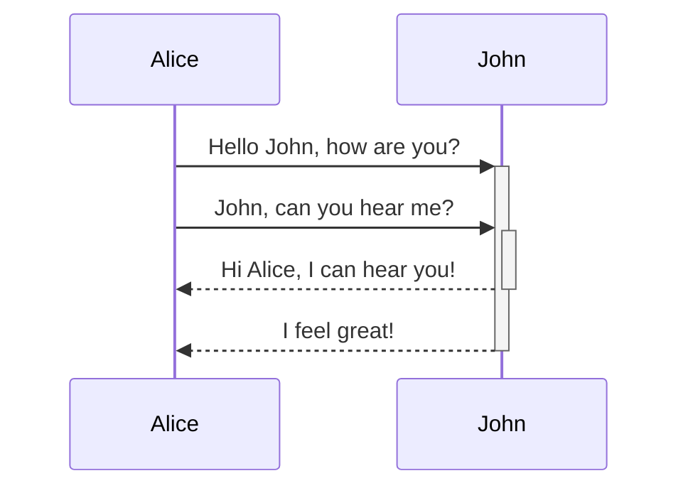
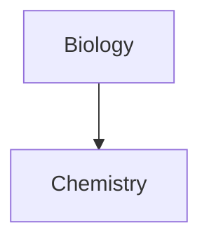

# Introdução

Lorem ipsum dolor sit amet, consectetur adipiscing elit. Vestibulum consectetur, augue id euismod mattis, metus felis interdum ligula, in ullamcorper augue massa quis odio. Suspendisse eu aliquam purus. Aliquam nec urna arcu. Phasellus nec leo eget ipsum mattis sagittis eget lobortis risus. Nullam tincidunt accumsan egestas. Lorem ipsum dolor sit amet, consectetur adipiscing elit. Donec et eleifend sapien.

# Conclusão

Mauris varius fringilla maximus. Nullam fringilla orci eu tempor rhoncus. Vestibulum ante ipsum primis in faucibus orci luctus et ultrices posuere cubilia curae; Donec feugiat nulla ac ultrices auctor. Nullam tellus nunc, tristique eget quam eu, varius rhoncus nulla. Morbi id velit quis ante rutrum fringilla. Suspendisse condimentum massa id nisi condimentum facilisis. Quisque commodo erat et scelerisque laoreet. In elementum leo sagittis ipsum sagittis, vel efficitur felis placerat. Donec egestas fringilla arcu, ultricies venenatis tortor aliquam vitae. Duis vehicula sapien in eleifend iaculis. In libero turpis, sollicitudin vel quam a, finibus cursus orci. Fusce auctor nulla sit amet nisi rhoncus, nec semper turpis rhoncus. Fusce vehicula, eros eu efficitur sodales, lorem nulla commodo nunc, vel interdum tortor nunc auctor arcu. Ut rutrum hendrerit lacus sed ultricies. Pellentesque at tincidunt ante.

# Basic Formatting Syntax (heading 1)

## Headings (heading 2)

### This is a Heading 3

#### This is a Heading 4

##### This is a Heading 5

###### This is a Heading 6

## Bold, Italics, Highlights

| Style                  | Syntax                 | Example                                  | Output                                 |
| ---------------------- | ---------------------- | ---------------------------------------- | -------------------------------------- |
| Bold                   | `** **` or `__ __`     | `**Bold text**`                          | **Bold text**                          |
| Italic                 | `* *` or `_ _`         | `*Italic text*`                          | _Italic text_                          |
| Strikethrough          | `~~ ~~`                | `~~Striked out text~~`                   | ~~Striked out text~~                   |
| Bold and nested italic | `** **` and `_ _`      | `**Bold text and _nested italic_ text**` | **Bold text and _nested italic_ text** |
| Bold and italic        | `*** ***` or `___ ___` | `***Bold and italic text***`             | **_Bold and italic text_**             |

\*\*This line will not be bold\*\*

```markdown
\*\*This line will not be bold\*\*
```

\*_This line will be italic and show the asterisks_\*

```markdown
\**This line will be italic and show the asterisks*\*
```

## Internal Links

Obsidian supports two formats for [internal links](https://help.obsidian.md/Linking+notes+and+files/Internal+links) between notes:

- Wikilink: `[[Three laws of motion]]`
- Markdown: `[Three laws of motion](Three%20laws%20of%20motion.md)`

## External Links

If you want to link to an external URL, you can create an inline link by surrounding the link text in brackets (`[]`), and then the URL in parentheses (`()`).

```md
[Obsidian Help](https://help.obsidian.md)
```

[Obsidian Help](https://help.obsidian.md)

You can also create external links to files in other vaults, by linking to an [Obsidian URI](https://help.obsidian.md/Extending+Obsidian/Obsidian+URI).

```md
[Note](obsidian://open?vault=MainVault&file=Note.md)
```

### Escape Blank Spaces in Links

If your URL contains blank spaces, you must escape them by replacing them with `%20`.

```md
[My Note](obsidian://open?vault=MainVault&file=My%20Note.md)
```

You can also escape the URL by wrapping it with angled brackets (`< >`).

```md
[My Note](<obsidian://open?vault=MainVault&file=My Note.md>)
```

## External Images

You can add images with external URLs, by adding a `!` symbol before an [external link](<https://help.obsidian.md/Editing+and+formatting/Basic+formatting+syntax#External> links).

```md

```


You can change the image dimensions, by adding `|640x480` to the link destination, where 640 is the width and 480 is the height.

```md

```

If you only specify the width, the image scales according to its original aspect ratio. For example:

```md

```

> [!Tip]  
> If you want to add an image from inside your vault, you can also [embed an image in a note](<https://help.obsidian.md/Linking+notes+and+files/Embed+files#Embed> an image in a note).

## Quotes

> Human beings face ever more complex and urgent problems, and their effectiveness in dealing with these problems is a matter that is critical to the stability and continued progress of society.\

\- Doug Engelbart, 1961

> [!Tip]  
> You can turn your quote into a [callout](https://help.obsidian.md/Editing+and+formatting/Callouts) by adding `[!info]` as the first line in a quote.

> [!info] Quote  
> Human beings face ever more complex and urgent problems, and their effectiveness in dealing with these problems is a matter that is critical to the stability and continued progress of society.  
> \- Doug Engelbart, 1961

## Lists (and Nested lists)

- First list item
	- Subitem
		- Subitem
- Second list item
	- [ ] Task
		- [ ] Task
- Third list item

1. First list item
	1. List subitem
		1. List subitem
2. Second list item
	- Unordered nested list item
3. Third list item

## Checkboxes

- [ ] Unchecked
- [x] Checked ✅ 2024-10-03
- [X] Check with X
- [>] Scheduled/Deferred
- [-] Cancelled/Non-Task
- [?] Need more info
- [!] Important

## Horizontal Rule

You can use three or more stars `***`, hyphens `---`, or underscore `___` on its own line to add a horizontal bar. You can also separate symbols using spaces.

```md
***
****
* * *
---
----
- - -
___
____
_ _ _
```

---

## Code

### Inline Code

You can format code within a sentence using single backticks.

Text inside `backticks` on a line will be formatted like code.

If you want to put backticks in an inline code block, surround it with double backticks like so: inline ``code with a backtick ` inside``.

### Code Blocks

```python
import random

def generate_dummy_data(num_rows):
    data = []
    for _ in range(num_rows):
        row = {
            'id': random.randint(1, 1000),
            'name': f'Name{random.randint(1, 100)}',
            'value': random.uniform(1.0, 100.0)
        }
        data.append(row)
    return data

dummy_data = generate_dummy_data(30)

for entry in dummy_data:
    print(entry)

```

> [!NOTE]  
> Source mode and Live Preview do not support PrismJS, and may render syntax highlighting differently.

## Footnotes

You can add footnotes to your notes using the following syntax:

```md
This is a simple footnote[^1].

[^1]: This is the referenced text.
[^2]: Add 2 spaces at the start of each new line.
  This lets you write footnotes that span multiple lines.
[^note]: Named footnotes still appear as numbers, but can make it easier to identify and link references.
```

You can also inline footnotes in a sentence. Note that the caret goes outside the brackets.

```md
You can also use inline footnotes. ^[This is an inline footnote.]
```

> [!Note]  
Inline footnotes only work in reading view, not in Live Preview.

## Comments

You can add comments by wrapping text with `%%`. Comments are only visible in Editing view.

This is an %%inline%% comment.

%%
This is a block comment.

Block comments can span multiple lines.
%%

# Advanced Formatting Syntax

## Tables

| First name | Last name |
| ---------- | --------- |
| Max        | Planck    |
| Marie      | Curie     |

```md
First name | Last name
-- | --
Max | Planck
Marie | Curie
```

### Format Content within a Table

You can use [basic formatting syntax](https://help.obsidian.md/Editing+and+formatting/Basic+formatting+syntax) to style content within a table.

| First column                                                                      | Second column                                                                                                      |
| --------------------------------------------------------------------------------- | ------------------------------------------------------------------------------------------------------------------ |
| [Internal links](https://help.obsidian.md/Linking+notes+and+files/Internal+links) | Link to a file _within_ your **vault**.                                                                            |
| [Embed files](https://help.obsidian.md/Linking+notes+and+files/Embed+files)       | |

Vertical bars in tables

If you want to use [aliases](https://help.obsidian.md/Linking+notes+and+files/Aliases), or to [resize an image](<https://help.obsidian.md/Editing+and+formatting/Basic+formatting+syntax#External> images) in your table, you need to add a `\` before the vertical bar.

```md
First column | Second column
-- | --
[[Basic formatting syntax\|Markdown syntax]] | ![[Engelbart.jpg\|200]]
```

|First column|Second column|
|---|---|
|[Markdown syntax](https://help.obsidian.md/Editing+and+formatting/Basic+formatting+syntax)||

You can align text to the left, right, or center of a column by adding colons (`:`) to the header row.

```md
Left-aligned text | Center-aligned text | Right-aligned text
:-- | :--: | --:
Content | Content | Content
```

| Left-aligned text | Center-aligned text | Right-aligned text |
|:---------------- |:-----------------: | -----------------: |
| Content           |       Content       |            Content |

## Diagram

You can add diagrams and charts to your notes, using [Mermaid](https://mermaid-js.github.io/). Mermaid supports a range of diagrams, such as [flow charts](https://mermaid.js.org/syntax/flowchart.html), [sequence diagrams](https://mermaid.js.org/syntax/sequenceDiagram.html), and [timelines](https://mermaid.js.org/syntax/timeline.html).

Tip

You can also try Mermaid's [Live Editor](https://mermaid-js.github.io/mermaid-live-editor) to help you build diagrams before you include them in your notes.

To add a Mermaid diagram, create a `mermaid` [code block](<https://help.obsidian.md/Editing+and+formatting/Basic+formatting+syntax#Code> blocks).

````md

````

````md

````

### Linking Files in a Diagram

You can create [internal links](https://help.obsidian.md/Linking+notes+and+files/Internal+links) in your diagrams by attaching the `internal-link` [class](https://mermaid.js.org/syntax/flowchart.html#classes) to your nodes.

````md

````

Note

Internal links from diagrams don't show up in the [Graph view](https://help.obsidian.md/Plugins/Graph+view).

If you have many nodes in your diagrams, you can use the following snippet.

````md

````

This way, each letter node becomes an internal link, with the [node text](https://mermaid.js.org/syntax/flowchart.html#a-node-with-text) as the link text.

Note

If you use special characters in your note names, you need to put the note name in double quotes.

```plaintext
class "⨳ special character" internal-link
```

Or, `A["⨳ special character"]`.

For more information about creating diagrams, refer to the [official Mermaid docs](https://mermaid.js.org/intro/).

## Math

You can add math expressions to your notes using [MathJax](http://docs.mathjax.org/en/latest/basic/mathjax.html) and the LaTeX notation.

To add a MathJax expression to your note, surround it with double dollar signs (`$$`).

```md
$$
\begin{vmatrix}a & b\\
c & d
\end{vmatrix}=ad-bc
$$
```

You can also inline math expressions by wrapping it in `$` symbols.

```md
This is an inline math expression $e^{2i\pi} = 1$.
```

This is an inline math expression

.

# Plugins

## Admonition

### Callout Version

> [!tip] This is a tip  
> This is the content of the callout tipo

### Code Block Version

```ad-tip
title: This is a tip
This is the content of the admonition tip.
```

# Snippets

This is a model file to show all the custom snippets and functions available on my vault.

## CSS Classes

The Css Classes are used to style the notes and pages on my vault. Here is a list of all the cssclasses available on my vault and their respective styles (.css files):

### Daily (daily-notes-themes.css)

- `daily` -> This class is used to style the daily notes on my vault;
- `sunday`, `Sunday` -> Defines a color scheme with a light pink highlight, a primary red, and a dark maroon;
- `monday`, `Monday` -> Defines a color scheme with a light peach highlight, a primary orange, and a dark brown;
- `tuesday`, `Tuesday` -> Defines a color scheme with a light sky blue highlight, a primary blue, and a dark navy;
- `wednesday`, `Wednesday` -> Defines a color scheme with a light cream highlight, a primary yellow, and a dark brown;
- `thursday`, `Thursday` -> Defines a color scheme with a light peach highlight, a primary orange, and a dark brown;
- `friday`, `Friday` -> Defines a color scheme with a light lime highlight, a primary green, and a dark green;
- `saturday`, `Saturday` -> Defines a color scheme with a light pink highlight, a primary red, and a dark maroon.

### Notebook Styles (notebook-backgrounds.css)

- `recolor-images` -> used to recolor images with transparent backgrounds;
- Pen Colors:
  - `pen-white`;
  - `pen-gray`;
  - `pen-black`;
  - `pen-red`;
  - `pen-green`;
  - `pen-blue`;
  - `pen-light-blue`;
  - `pen-purple`;
  - `neutral-pen-black`;
  - `neutral-pen-black-trans`;
- Page Colors:
  - `page-white`;
  - `page-manila`;
  - `page-blue`;
- Grids:
  - `page-grid`

### General Tweaks (jts-general-tweaks.css)

- `theme-light` ->;
- `theme-dark` ->;
- `image-borders` ->;
- `markdown-preview-view` ->;
- `callout` ->;
- `task-list-item-checkbox` ->;
- `center-images` ->;
- `no-embed-border` ->;
- `markdown-preview-view` ->;
- `center-titles` ->.

## Better Highlights (realistic-highlights.css)

- **Simple highlight:** ==lorem ipsum dolor sit amet, consectetur adipiscing elit, sed do eiusmod tempor, incididunt ut labore et dolore magna aliqua.==
- **Custom:** <mark class="purple">lorem ipsum dolor sit amet, consectetur adipiscing elit. Etiam sodales accumsan arcu sed blandit. Sed at sem quis quam posuere luctus.</mark> Mauris dignissim, nisi vel efficitur mollis, turpis nulla viverra dui, <mark class="pink">nec fringilla enim sapien condimentum ex.</mark> Phasellus ultricies orci vel nibh vehicula, ac interdum sapien fermentum. <mark class="green">Mauris sollicitudin urna eu velit pharetra mattis. Donec dui lectus, dignissim eget enim ut, luctus iaculis nunc.</mark> Quisque consequat iaculis neque, vel rhoncus purus pellentesque a. Etiam vel velit nunc. Cras nibh risus, ullamcorper non aliquam eu, consequat luctus mauris. <mark class="blue">Nunc gravida id elit id sodales. Phasellus sapien nisi, pretium quis nunc sit amet, placerat sagittis tortor.</mark> Ut eu sapien lectus. Etiam rutrum purus nulla, nec pellentesque augue venenatis eleifend. Fusce eu vestibulum ante.

## Blocks (notation-color-blocks.css)

### Note Background

```note-gray-background
This is a Note
Lorem ipsum dolor sit amet, consectetur adipiscing elit, sed do eiusmod tempor, incididunt ut labore et dolore magna aliqua.
```

```note-brown-background
This is a Note
Lorem ipsum dolor sit amet, consectetur adipiscing elit, sed do eiusmod tempor, incididunt ut labore et dolore magna aliqua.
```

```note-yellow-background
This is a Note
Lorem ipsum dolor sit amet, consectetur adipiscing elit, sed do eiusmod tempor, incididunt ut labore et dolore magna aliqua.
```

```note-green-background
This is a Note
Lorem ipsum dolor sit amet, consectetur adipiscing elit, sed do eiusmod tempor, incididunt ut labore et dolore magna aliqua.
```

```note-blue-background
This is a Note
Lorem ipsum dolor sit amet, consectetur adipiscing elit, sed do eiusmod tempor, incididunt ut labore et dolore magna aliqua.
```

```note-purple-background
This is a Note
Lorem ipsum dolor sit amet, consectetur adipiscing elit, sed do eiusmod tempor, incididunt ut labore et dolore magna aliqua.
```

```note-pink-background
This is a Note
Lorem ipsum dolor sit amet, consectetur adipiscing elit, sed do eiusmod tempor, incididunt ut labore et dolore magna aliqua.
```

```note-red-background
This is a Note
Lorem ipsum dolor sit amet, consectetur adipiscing elit, sed do eiusmod tempor, incididunt ut labore et dolore magna aliqua.
```

---

### Notes Foreground

```note-gray
This is a Note
Lorem ipsum dolor sit amet, consectetur adipiscing elit, sed do eiusmod tempor, incididunt ut labore et dolore magna aliqua.
```

```note-brown
This is a Note
Lorem ipsum dolor sit amet, consectetur adipiscing elit, sed do eiusmod tempor, incididunt ut labore et dolore magna aliqua.
```

```note-yellow
This is a Note
Lorem ipsum dolor sit amet, consectetur adipiscing elit, sed do eiusmod tempor, incididunt ut labore et dolore magna aliqua.
```

```note-green
This is a Note
Lorem ipsum dolor sit amet, consectetur adipiscing elit, sed do eiusmod tempor, incididunt ut labore et dolore magna aliqua.
```

```note-blue
This is a Note
Lorem ipsum dolor sit amet, consectetur adipiscing elit, sed do eiusmod tempor, incididunt ut labore et dolore magna aliqua.
```

```note-purple
This is a Note
Lorem ipsum dolor sit amet, consectetur adipiscing elit, sed do eiusmod tempor, incididunt ut labore et dolore magna aliqua.
```

```note-pink
This is a Note
Lorem ipsum dolor sit amet, consectetur adipiscing elit, sed do eiusmod tempor, incididunt ut labore et dolore magna aliqua.
```

```note-red
This is a Note
Lorem ipsum dolor sit amet, consectetur adipiscing elit, sed do eiusmod tempor, incididunt ut labore et dolore magna aliqua.
```

---

### Spans Foreground

<span class="gray">This is a Note

Lorem ipsum dolor sit amet, consectetur adipiscing elit, sed do eiusmod tempor, incididunt ut labore et dolore magna aliqua.</span>

<span class="brown">This is a Note

Lorem ipsum dolor sit amet, consectetur adipiscing elit, sed do eiusmod tempor, incididunt ut labore et dolore magna aliqua.</span>

<span class="orange">This is a Note

Lorem ipsum dolor sit amet, consectetur adipiscing elit, sed do eiusmod tempor, incididunt ut labore et dolore magna aliqua.</span>

<span class="yellow">This is a Note

Lorem ipsum dolor sit amet, consectetur adipiscing elit, sed do eiusmod tempor, incididunt ut labore et dolore magna aliqua.</span>

<span class="green">This is a Note

Lorem ipsum dolor sit amet, consectetur adipiscing elit, sed do eiusmod tempor, incididunt ut labore et dolore magna aliqua.</span>

<span class="blue">This is a Note

Lorem ipsum dolor sit amet, consectetur adipiscing elit, sed do eiusmod tempor, incididunt ut labore et dolore magna aliqua.</span>

<span class="purple">This is a Note

Lorem ipsum dolor sit amet, consectetur adipiscing elit, sed do eiusmod tempor, incididunt ut labore et dolore magna aliqua.</span>

<span class="pink">This is a Note

Lorem ipsum dolor sit amet, consectetur adipiscing elit, sed do eiusmod tempor, incididunt ut labore et dolore magna aliqua.</span>

<span class="red">This is a Note
Lorem ipsum dolor sit amet, consectetur adipiscing elit, sed do eiusmod tempor, incididunt ut labore et dolore magna aliqua.</span>
---

### Spans Background

<span class="gray-bg">This is a Note

Lorem ipsum dolor sit amet, consectetur adipiscing elit, sed do eiusmod tempor, incididunt ut labore et dolore magna aliqua.</span>

<span class="brown-bg">This is a Note

Lorem ipsum dolor sit amet, consectetur adipiscing elit, sed do eiusmod tempor, incididunt ut labore et dolore magna aliqua.</span>

<span class="orange-bg">This is a Note

Lorem ipsum dolor sit amet, consectetur adipiscing elit, sed do eiusmod tempor, incididunt ut labore et dolore magna aliqua.</span>

<span class="yellow-bg">This is a Note

Lorem ipsum dolor sit amet, consectetur adipiscing elit, sed do eiusmod tempor, incididunt ut labore et dolore magna aliqua.</span>

<span class="green-bg">This is a Note

Lorem ipsum dolor sit amet, consectetur adipiscing elit, sed do eiusmod tempor, incididunt ut labore et dolore magna aliqua.</span>

<span class="blue-bg">This is a Note

Lorem ipsum dolor sit amet, consectetur adipiscing elit, sed do eiusmod tempor, incididunt ut labore et dolore magna aliqua.</span>

<span class="purple-bg">This is a Note

Lorem ipsum dolor sit amet, consectetur adipiscing elit, sed do eiusmod tempor, incididunt ut labore et dolore magna aliqua.</span>

<span class="pink-bg">This is a Note

Lorem ipsum dolor sit amet, consectetur adipiscing elit, sed do eiusmod tempor, incididunt ut labore et dolore magna aliqua.</span>

<span class="red-bg">This is a Note

Lorem ipsum dolor sit amet, consectetur adipiscing elit, sed do eiusmod tempor, incididunt ut labore et dolore magna aliqua.</span>
