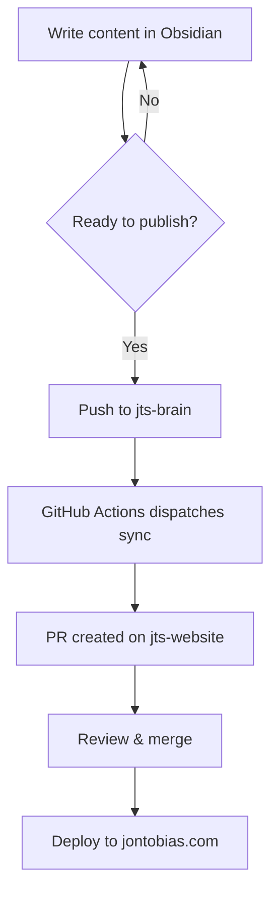
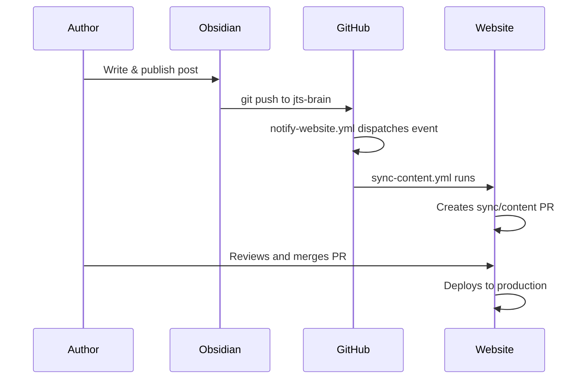
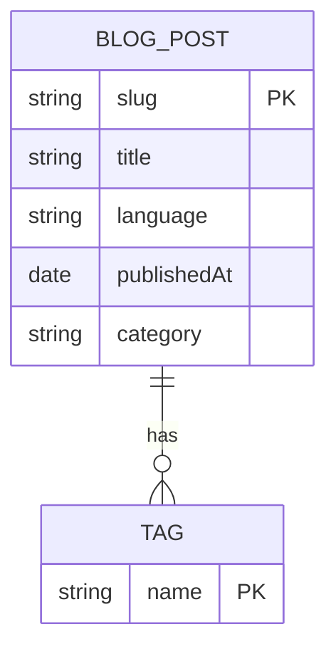

## Introduction

This post is the authoritative reference for writing blog posts and notes on this website. It covers every supported markdown element—from basic typography to custom Obsidian snippets—along with their rendered output. Keep this open when drafting content.

> **How to read this cheatsheet:** each section shows the markdown syntax followed by its rendered result. Elements not yet styled on the website are included as-is, so they serve as a specification for future implementation.

---

## Basic typography (this is H2—section)

### Headings (this is H3—section sub-topic)

Headings use `#` prefixes (H1–H6). In post bodies, H2 is reserved for major section titles; H3–H4 are most common for sub-sections. H1 is reserved for the page title and never appears in prose.

#### Heading 4—fine-grained breakdown

##### Heading 5—rarely used

###### Heading 6—deepest level

### Text formatting

| Style         | Syntax                   | Output                |
| ------------- | ------------------------ | --------------------- |
| Bold          | `**text**` or `__text__` | **Bold text**         |
| Italic        | `*text*` or `_text_`     | *Italic text*         |
| Bold + italic | `***text***`             | ***Bold and italic*** |
| Strikethrough | `~~text~~`               | ~~Striked out~~       |
| Inline code   | `` `code` ``             | `inline code`         |
| Highlight     | `==text==`               | ==highlighted text==  |

### Inline code

Use single backticks for inline code: `const x = 42;`

For backticks inside inline code, use double backticks: ``use `backticks` here``

### Highlights (Better Highlights snippet)

- **Default highlight:** ==lorem ipsum dolor sit amet, consectetur adipiscing elit.==
- **Purple:** <mark class="purple">lorem ipsum dolor sit amet, consectetur adipiscing elit.</mark>
- **Pink:** <mark class="pink">lorem ipsum dolor sit amet, consectetur adipiscing elit.</mark>
- **Green:** <mark class="green">lorem ipsum dolor sit amet, consectetur adipiscing elit.</mark>
- **Blue:** <mark class="blue">lorem ipsum dolor sit amet, consectetur adipiscing elit.</mark>

---

## Links and media

### External links

```md
[Link text](https://example.com)
[Link with title](https://example.com "Hover title")
```

Example: [Astro documentation](https://docs.astro.build)

### Escaping spaces in URLs

```md
[My File](obsidian://open?vault=Vault&file=My%20File.md)
[My File](<obsidian://open?vault=Vault&file=My File.md>)
```

### Images

```md


```

Example with external image:


Resized to 200px wide:


### Internal links (Obsidian)

Obsidian wiki-links are vault-local and not supported on the website. Use standard markdown links for content that will be published.

```md
<!-- Obsidian only — not rendered on website -->
[[Note Title]]
[[Note Title|Custom Display Text]]

<!-- Use this instead for published content -->
[Note Title](/blog/note-slug)
```

---

## Block elements

### Paragraphs

Separate paragraphs with a blank line. A single line break within a paragraph is treated as a space.

This is the first paragraph. It has multiple sentences.

This is the second paragraph, separated by a blank line above.

### Blockquotes

```md
> Single-line quote.

> Multi-line quote.
> Continues on the same block.
>
> New paragraph inside the quote.
```

> Human beings face ever more complex and urgent problems, and their effectiveness in dealing with these problems is a matter that is critical to the stability and continued progress of society.
>
> —Doug Engelbart, 1961

### Callouts

Callouts extend blockquotes with a `[!type]` tag. All types below use the same syntax:

```md
> [!note] Optional custom title
> Callout content here.
```

**Available callout types:**

> [!note] Note  
> General annotations and side notes. Aliases: `note`, `seealso`.

> [!abstract] Abstract  
> Summaries and TL;DRs. Aliases: `abstract`, `summary`, `tldr`.

> [!info] Info  
> Informational content and to-dos. Aliases: `info`, `todo`.

> [!tip] Tip  
> Helpful hints and important highlights. Aliases: `tip`, `hint`, `important`.

> [!success] Success  
> Confirmations and completed items. Aliases: `success`, `check`, `done`.

> [!question] Question  
> Open questions and FAQs. Aliases: `question`, `help`, `faq`.

> [!warning] Warning  
> Cautions and things to watch out for. Aliases: `warning`, `caution`, `attention`.

> [!failure] Failure  
> Errors and missing elements. Aliases: `failure`, `fail`, `missing`.

> [!danger] Danger  
> Critical errors and dangerous operations. Aliases: `danger`, `error`.

> [!bug] Bug  
> Known bugs and issues.

> [!example] Example  
> Worked examples and demonstrations.

> [!quote] Quote  
> Attributed quotations. Aliases: `quote`, `cite`.

**Collapsible callouts** (add `+` to expand by default, `-` to collapse by default):

```md
> [!tip]- This callout is collapsed by default
> Content only visible after expanding.

> [!tip]+ This callout is expanded by default
> Content visible immediately.
```

> [!tip]- Collapsed callout (click to expand)  
> This content is hidden until the callout is opened.

### Lists

#### Unordered list

```md
- Item one
  - Nested item
    - Deeply nested
- Item two
- Item three
```

- First item
  - Nested item
    - Deeply nested
- Second item
- Third item

#### Ordered list

```md
1. First step
   1. Sub-step
2. Second step
3. Third step
```

1. First step
   1. Sub-step
2. Second step
3. Third step

#### Mixed nesting

1. Ordered item
   - Unordered nested
   - Another unordered
2. Back to ordered

#### Task lists (Checkboxes)

```md
- [ ] Unchecked item
- [x] Checked item ✅
- [X] Also checked
- [>] Scheduled / Deferred
- [-] Cancelled
- [?] Needs more info
- [!] Important
```

- [ ] Unchecked item
- [x] Checked item ✅ 2026-03-30
- [X] Also checked with uppercase X
- [>] Scheduled / Deferred
- [-] Cancelled
- [?] Needs more info
- [!] Important

Three or more hyphens, asterisks, or underscores on their own line:

```md
---
***
___
```

---

### Footnotes

```md
This sentence has a footnote.[^1]

You can also use named footnotes.[^named]

Inline footnotes work too.^[This appears at the bottom.]

[^1]: This is the footnote text.
[^named]: Named footnotes still render as numbers.
```

This sentence has a footnote.[^1]

Here is a named footnote reference.[^2]

### Comments

Obsidian comments are stripped from the rendered output:

```md
This is visible. %%This is hidden.%%

%%
This entire block is hidden.
Multi-line comments work too.
%%
```

This is visible. %%This comment is hidden on the website.%%

---

## Code blocks

Fenced code blocks use triple backticks with an optional language identifier for syntax highlighting.

### Bash / Shell

```bash
#!/usr/bin/env bash
set -euo pipefail

echo "Deploying to production..."
git pull origin main && npm run build
```

### Python

```python
import random

def generate_data(n: int) -> list[dict]:
    return [
        {"id": i, "value": random.uniform(0, 100)}
        for i in range(n)
    ]

data = generate_data(10)
print(data)
```

### TypeScript

```typescript
interface Post {
  slug: string;
  title: string;
  publishedAt: Date;
  tags: string[];
}

function formatDate(date: Date): string {
  return date.toLocaleDateString('en-US', { dateStyle: 'long' });
}
```

### C / Embedded

```c
#include <stdint.h>
#include <stdbool.h>

typedef struct {
    uint8_t address;
    uint32_t baud_rate;
    bool enabled;
} uart_config_t;

void uart_init(const uart_config_t *cfg) {
    /* Configure peripheral registers */
}
```

### YAML / TOML / JSON

```yaml
name: Deploy Website
on:
  push:
    branches: [main]
jobs:
  build:
    runs-on: ubuntu-latest
    steps:
      - uses: actions/checkout@v4
```

```json
{
  "name": "jts-website",
  "scripts": {
    "dev": "astro dev",
    "build": "astro build"
  }
}
```

### Markdown (Nested)

````md
```bash
echo "nested code block example"
```
````

---

## Tables

### Basic table

```md
| Column 1 | Column 2 | Column 3 |
| --- | --- | --- |
| A | B | C |
| D | E | F |
```

| Column 1 | Column 2 | Column 3 |
| --- | --- | --- |
| A | B | C |
| D | E | F |

### Aligned columns

```md
| Left-aligned | Centered | Right-aligned |
| :--- | :---: | ---: |
| Text | Text | Text |
| Longer text | Longer text | Longer text |
```

| Left-aligned | Centered | Right-aligned |
|:--- |:---: | ---: |
| Text | Text | Text |
| Longer text | Longer text | Longer text |

### Table with formatting

| Feature | Status | Notes |
| --- |:---: | --- |
| Headings | ✅ | H1–H6 supported |
| Code blocks | ✅ | Shiki syntax highlighting |
| Callouts | 🚧 | Styled as plain blockquotes |
| Mermaid | 🚧 | Renders as code block |
| Math | 🚧 | Renders as plain text |
| Custom highlights | 🚧 | CSS not yet added |

---

## Diagrams (Mermaid)

Mermaid diagrams use a `mermaid` fenced code block. They will be rendered as interactive diagrams once the integration is added.

### Flowchart



### Sequence diagram



### Entity relationship diagram



---

## Math—LaTeX

Math expressions use MathJax with LaTeX notation. Block math uses `$$`, inline uses `$`.

### Block math

```md
$$
E = mc^2
$$
```

$$
E = mc^2
$$

```md
$$
\begin{vmatrix} a & b \\ c & d \end{vmatrix} = ad - bc
$$
```

$$
\begin{vmatrix} a & b \\ c & d \end{vmatrix} = ad - bc
$$

### Inline math

```md
The quadratic formula is $x = \frac{-b \pm \sqrt{b^2 - 4ac}}{2a}$.
```

The quadratic formula is $x = \frac{-b \pm \sqrt{b^2 - 4ac}}{2a}$.

---

## Custom snippets (Obsidian CSS)

These elements use custom CSS classes from Obsidian snippet files. They are included here as the specification for website implementation.

### Colored spans—Foreground text

Use `<span class="COLOR">text</span>` to apply foreground colors:

<span class="gray">Gray foreground text—lorem ipsum dolor sit amet.</span>

<span class="brown">Brown foreground text—lorem ipsum dolor sit amet.</span>

<span class="orange">Orange foreground text—lorem ipsum dolor sit amet.</span>

<span class="yellow">Yellow foreground text—lorem ipsum dolor sit amet.</span>

<span class="green">Green foreground text—lorem ipsum dolor sit amet.</span>

<span class="blue">Blue foreground text—lorem ipsum dolor sit amet.</span>

<span class="purple">Purple foreground text—lorem ipsum dolor sit amet.</span>

<span class="pink">Pink foreground text—lorem ipsum dolor sit amet.</span>

<span class="red">Red foreground text—lorem ipsum dolor sit amet.</span>

### Colored spans—Background

Use `<span class="COLOR-bg">text</span>` for colored background highlights:

<span class="gray-bg">Gray background—lorem ipsum dolor sit amet.</span>

<span class="brown-bg">Brown background—lorem ipsum dolor sit amet.</span>

<span class="orange-bg">Orange background—lorem ipsum dolor sit amet.</span>

<span class="yellow-bg">Yellow background—lorem ipsum dolor sit amet.</span>

<span class="green-bg">Green background—lorem ipsum dolor sit amet.</span>

<span class="blue-bg">Blue background—lorem ipsum dolor sit amet.</span>

<span class="purple-bg">Purple background—lorem ipsum dolor sit amet.</span>

<span class="pink-bg">Pink background—lorem ipsum dolor sit amet.</span>

<span class="red-bg">Red background—lorem ipsum dolor sit amet.</span>

### Note blocks—Foreground (notation-color-blocks.css)

Use a fenced code block with a `note-COLOR` language identifier:

```note-gray
Gray note block
Lorem ipsum dolor sit amet, consectetur adipiscing elit.
```

```note-brown
Brown note block
Lorem ipsum dolor sit amet, consectetur adipiscing elit.
```

```note-yellow
Yellow note block
Lorem ipsum dolor sit amet, consectetur adipiscing elit.
```

```note-green
Green note block
Lorem ipsum dolor sit amet, consectetur adipiscing elit.
```

```note-blue
Blue note block
Lorem ipsum dolor sit amet, consectetur adipiscing elit.
```

```note-purple
Purple note block
Lorem ipsum dolor sit amet, consectetur adipiscing elit.
```

```note-pink
Pink note block
Lorem ipsum dolor sit amet, consectetur adipiscing elit.
```

```note-red
Red note block
Lorem ipsum dolor sit amet, consectetur adipiscing elit.
```

### Note blocks—Background (notation-color-blocks.css)

Use a fenced code block with a `note-COLOR-background` language identifier:

```note-gray-background
Gray background note block
Lorem ipsum dolor sit amet, consectetur adipiscing elit.
```

```note-brown-background
Brown background note block
Lorem ipsum dolor sit amet, consectetur adipiscing elit.
```

```note-yellow-background
Yellow background note block
Lorem ipsum dolor sit amet, consectetur adipiscing elit.
```

```note-green-background
Green background note block
Lorem ipsum dolor sit amet, consectetur adipiscing elit.
```

```note-blue-background
Blue background note block
Lorem ipsum dolor sit amet, consectetur adipiscing elit.
```

```note-purple-background
Purple background note block
Lorem ipsum dolor sit amet, consectetur adipiscing elit.
```

```note-pink-background
Pink background note block
Lorem ipsum dolor sit amet, consectetur adipiscing elit.
```

```note-red-background
Red background note block
Lorem ipsum dolor sit amet, consectetur adipiscing elit.
```

---

## Conclusion

This cheatsheet is a living document. As new rendering features are added to the website—callout styling, Mermaid integration, MathJax, and custom color tokens—this post will serve as both the specification and the visual regression test. Each section above can be visited in the browser to verify that the rendered output matches the intended design.

To contribute a new element or report a rendering issue, open a pull request on [jts-website](https://github.com/JonathanTSilva/jts-website) or update this file in the Obsidian vault and push to trigger the sync pipeline.

[^1]: This is footnote number one.
[^2]: Named footnotes still render as sequential numbers.
