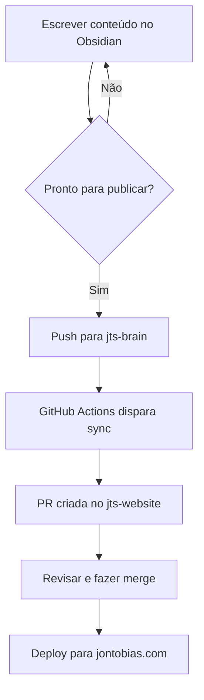
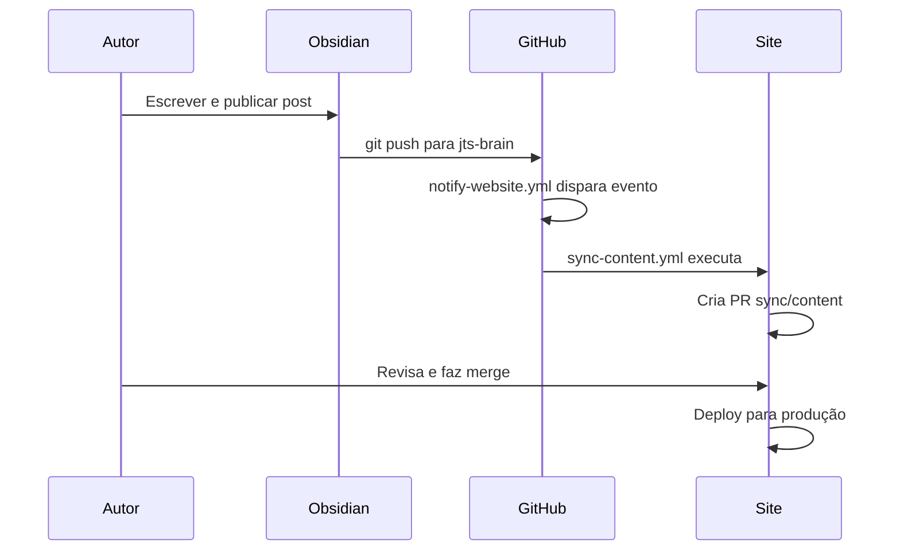
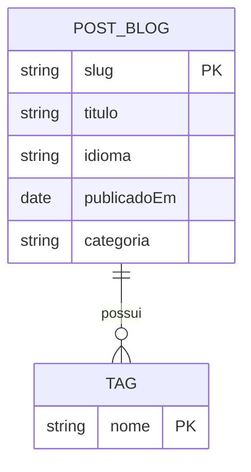

## Introdução

Este post é a referência definitiva para escrever posts e notas neste site. Cobre todos os elementos markdown suportados—desde tipografia básica até snippets personalizados do Obsidian—com seus resultados renderizados. Mantenha este post aberto enquanto escreve conteúdo.

> **Como usar este cheatsheet:** cada seção mostra a sintaxe markdown seguida pelo resultado renderizado. Elementos ainda não estilizados no site estão incluídos como especificação para implementação futura.

---

## Tipografia Básica

## Títulos (Headings)

Títulos usam prefixos `#` (H1–H6). Em corpos de posts, H2 é o título de seção de nível superior; H3–H4 são os mais comuns para sub-seções. H1 é reservado para o título da página e nunca aparece no corpo do texto.

### Título 3—subtópico De Seção

#### Título 4—divisão Detalhada

##### Título 5—raramente Usado

###### Título 6—nível Mais Profundo

## Formatação De Texto

| Estilo | Sintaxe | Resultado |
| --- | --- | --- |
| Negrito | `**texto**` ou `__texto__` | **Texto em negrito** |
| Itálico | `*texto*` ou `_texto_` | *Texto em itálico* |
| Negrito + itálico | `***texto***` | ***Negrito e itálico*** |
| Tachado | `~~texto~~` | ~~Texto tachado~~ |
| Código inline | `` `código` `` | `código inline` |
| Destaque | `==texto==` | ==texto destacado== |

## Código Inline

Use crases simples para código inline: `const x = 42;`

Para crases dentro de código inline, use crases duplas: ``use `crases` aqui``

## Destaques (snippet Better Highlights)

- **Destaque padrão:** ==lorem ipsum dolor sit amet, consectetur adipiscing elit.==
- **Roxo:** <mark class="purple">lorem ipsum dolor sit amet, consectetur adipiscing elit.</mark>
- **Rosa:** <mark class="pink">lorem ipsum dolor sit amet, consectetur adipiscing elit.</mark>
- **Verde:** <mark class="green">lorem ipsum dolor sit amet, consectetur adipiscing elit.</mark>
- **Azul:** <mark class="blue">lorem ipsum dolor sit amet, consectetur adipiscing elit.</mark>

---

## Links E Mídia

## Links Externos

```md
[Texto do link](https://exemplo.com)
[Link com título](https://exemplo.com "Título ao passar o mouse")
```

Exemplo: [Documentação do Astro](https://docs.astro.build)

## Escapando Espaços Em URLs

```md
[Meu Arquivo](obsidian://open?vault=Vault&file=Meu%20Arquivo.md)
[Meu Arquivo](<obsidian://open?vault=Vault&file=Meu Arquivo.md>)
```

## Imagens

```md


```

Exemplo com imagem externa:


Redimensionada para 200px de largura:


## Links Internos (Obsidian)

Wiki-links do Obsidian são locais do vault e não são suportados no site. Use links markdown padrão para conteúdo que será publicado.

```md
<!-- Apenas no Obsidian — não renderizado no site -->
[[Título da Nota]]
[[Título da Nota|Texto personalizado]]

<!-- Use este formato para conteúdo publicado -->
[Título da Nota](/blog/slug-da-nota)
```

---

## Elementos Em Bloco

## Parágrafos

Separe parágrafos com uma linha em branco. Uma quebra de linha simples dentro de um parágrafo é tratada como espaço.

Este é o primeiro parágrafo com várias frases.

Este é o segundo parágrafo, separado por uma linha em branco acima.

## Citações (Blockquotes)

```md
> Citação de uma linha.

> Citação com múltiplas linhas.
> Continua no mesmo bloco.
>
> Novo parágrafo dentro da citação.
```

> Os seres humanos enfrentam problemas cada vez mais complexos e urgentes, e sua eficácia em lidar com esses problemas é uma questão crítica para a estabilidade e o progresso contínuo da sociedade.
>
> —Doug Engelbart, 1961

## Callouts

Callouts estendem as citações com uma tag `[!tipo]`. Todos os tipos abaixo usam a mesma sintaxe:

```md
> [!note] Título personalizado opcional
> Conteúdo do callout aqui.
```

**Tipos de callout disponíveis:**

> [!note] Nota  
> Anotações gerais e notas laterais. Aliases: `note`, `seealso`.

> [!abstract] Resumo  
> Sumários e TL;DRs. Aliases: `abstract`, `summary`, `tldr`.

> [!info] Informação  
> Conteúdo informativo e tarefas. Aliases: `info`, `todo`.

> [!tip] Dica  
> Sugestões úteis e destaques importantes. Aliases: `tip`, `hint`, `important`.

> [!success] Sucesso  
> Confirmações e itens concluídos. Aliases: `success`, `check`, `done`.

> [!question] Pergunta  
> Dúvidas abertas e FAQs. Aliases: `question`, `help`, `faq`.

> [!warning] Aviso  
> Precauções e pontos de atenção. Aliases: `warning`, `caution`, `attention`.

> [!failure] Falha  
> Erros e elementos ausentes. Aliases: `failure`, `fail`, `missing`.

> [!danger] Perigo  
> Erros críticos e operações perigosas. Aliases: `danger`, `error`.

> [!bug] Bug  
> Bugs conhecidos e problemas.

> [!example] Exemplo  
> Exemplos práticos e demonstrações.

> [!quote] Citação  
> Citações com atribuição. Aliases: `quote`, `cite`.

**Callouts recolhíveis** (adicione `+` para expandido por padrão, `-` para recolhido):

```md
> [!tip]- Este callout está recolhido por padrão
> Conteúdo visível apenas após expandir.

> [!tip]+ Este callout está expandido por padrão
> Conteúdo visível imediatamente.
```

> [!tip]- Callout recolhido (clique para expandir)  
> Este conteúdo fica oculto até o callout ser aberto.

## Listas

### Lista Não Ordenada

```md
- Item um
  - Item aninhado
    - Profundamente aninhado
- Item dois
- Item três
```

- Primeiro item
  - Item aninhado
    - Profundamente aninhado
- Segundo item
- Terceiro item

### Lista Ordenada

```md
1. Primeiro passo
   1. Sub-passo
2. Segundo passo
3. Terceiro passo
```

1. Primeiro passo
   1. Sub-passo
2. Segundo passo
3. Terceiro passo

### Aninhamento Misto

1. Item ordenado
   - Não ordenado aninhado
   - Outro não ordenado
2. De volta ao ordenado

### Listas De Tarefas (Checkboxes)

```md
- [ ] Item não marcado
- [x] Item marcado ✅
- [X] Também marcado
- [>] Agendado / Adiado
- [-] Cancelado
- [?] Precisa de mais informações
- [!] Importante
```

- [ ] Item não marcado
- [x] Item marcado ✅ 2026-03-30
- [X] Também marcado com X maiúsculo
- [>] Agendado / Adiado
- [-] Cancelado
- [?] Precisa de mais informações
- [!] Importante

## Régua Horizontal

Três ou mais hífens, asteriscos ou underscores em sua própria linha:

```md
---
***
___
```

---

## Notas De Rodapé

```md
Esta frase tem uma nota de rodapé.[^1]

Também é possível usar notas nomeadas.[^nome]

Notas de rodapé inline também funcionam.^[Aparece no final.]

[^1]: Este é o texto da nota de rodapé.
[^nome]: Notas nomeadas ainda renderizam como números.
```

Esta frase tem uma nota de rodapé.[^1]

Aqui está uma referência de nota nomeada.[^2]

## Comentários

Comentários do Obsidian são removidos da saída renderizada:

```md
Isto é visível. %%Isto está oculto.%%

%%
Este bloco inteiro está oculto.
Comentários de múltiplas linhas funcionam também.
%%
```

Isto é visível. %%Este comentário está oculto no site.%%

---

## Blocos De Código

Blocos de código delimitados usam três crases com um identificador de linguagem opcional para destaque de sintaxe.

## Bash / Shell

```bash
#!/usr/bin/env bash
set -euo pipefail

echo "Fazendo deploy para produção..."
git pull origin main && npm run build
```

## Python

```python
import random

def gerar_dados(n: int) -> list[dict]:
    return [
        {"id": i, "valor": random.uniform(0, 100)}
        for i in range(n)
    ]

dados = gerar_dados(10)
print(dados)
```

## TypeScript

```typescript
interface Post {
  slug: string;
  titulo: string;
  publicadoEm: Date;
  tags: string[];
}

function formatarData(data: Date): string {
  return data.toLocaleDateString('pt-BR', { dateStyle: 'long' });
}
```

## C / Embarcado

```c
#include <stdint.h>
#include <stdbool.h>

typedef struct {
    uint8_t endereco;
    uint32_t baud_rate;
    bool habilitado;
} uart_config_t;

void uart_init(const uart_config_t *cfg) {
    /* Configurar registradores do periférico */
}
```

## YAML / JSON

```yaml
name: Deploy do Site
on:
  push:
    branches: [main]
jobs:
  build:
    runs-on: ubuntu-latest
    steps:
      - uses: actions/checkout@v4
```

```json
{
  "name": "jts-website",
  "scripts": {
    "dev": "astro dev",
    "build": "astro build"
  }
}
```

---

## Tabelas

## Tabela Básica

```md
| Coluna 1 | Coluna 2 | Coluna 3 |
| --- | --- | --- |
| A | B | C |
| D | E | F |
```

| Coluna 1 | Coluna 2 | Coluna 3 |
| --- | --- | --- |
| A | B | C |
| D | E | F |

## Colunas Alinhadas

```md
| Alinhado à esquerda | Centralizado | Alinhado à direita |
| :--- | :---: | ---: |
| Texto | Texto | Texto |
| Texto mais longo | Texto mais longo | Texto mais longo |
```

| Alinhado à esquerda | Centralizado | Alinhado à direita |
|:--- |:---: | ---: |
| Texto | Texto | Texto |
| Texto mais longo | Texto mais longo | Texto mais longo |

## Tabela Com Formatação

| Funcionalidade | Status | Notas |
| --- |:---: | --- |
| Títulos | ✅ | H1–H6 suportados |
| Blocos de código | ✅ | Destaque Shiki |
| Callouts | 🚧 | Renderizado como blockquote simples |
| Mermaid | 🚧 | Renderizado como bloco de código |
| Matemática | 🚧 | Renderizado como texto simples |
| Destaques coloridos | 🚧 | CSS ainda não adicionado |

---

## Diagramas (Mermaid)

Diagramas Mermaid usam um bloco de código com a linguagem `mermaid`. Serão renderizados como diagramas interativos quando a integração for adicionada.

## Fluxograma



## Diagrama De Sequência



## Diagrama Entidade-Relacionamento



---

## Matemática—LaTeX

Expressões matemáticas usam MathJax com notação LaTeX. Matemática em bloco usa `$$`, inline usa `$`.

## Matemática Em Bloco

```md
$$
E = mc^2
$$
```

$$
E = mc^2
$$

```md
$$
\begin{vmatrix} a & b \\ c & d \end{vmatrix} = ad - bc
$$
```

$$
\begin{vmatrix} a & b \\ c & d \end{vmatrix} = ad - bc
$$

## Matemática Inline

```md
A fórmula quadrática é $x = \frac{-b \pm \sqrt{b^2 - 4ac}}{2a}$.
```

A fórmula quadrática é $x = \frac{-b \pm \sqrt{b^2 - 4ac}}{2a}$.

---

## Snippets Personalizados (CSS Do Obsidian)

Estes elementos usam classes CSS personalizadas de arquivos de snippet do Obsidian. Estão incluídos aqui como especificação para implementação no site.

## Spans Coloridos—Texto (Cor De Frente)

Use `<span class="COR">texto</span>` para aplicar cores de frente:

<span class="gray">Texto cinza—lorem ipsum dolor sit amet.</span>

<span class="brown">Texto marrom—lorem ipsum dolor sit amet.</span>

<span class="orange">Texto laranja—lorem ipsum dolor sit amet.</span>

<span class="yellow">Texto amarelo—lorem ipsum dolor sit amet.</span>

<span class="green">Texto verde—lorem ipsum dolor sit amet.</span>

<span class="blue">Texto azul—lorem ipsum dolor sit amet.</span>

<span class="purple">Texto roxo—lorem ipsum dolor sit amet.</span>

<span class="pink">Texto rosa—lorem ipsum dolor sit amet.</span>

<span class="red">Texto vermelho—lorem ipsum dolor sit amet.</span>

## Spans Coloridos—Fundo

Use `<span class="COR-bg">texto</span>` para fundos coloridos:

<span class="gray-bg">Fundo cinza—lorem ipsum dolor sit amet.</span>

<span class="brown-bg">Fundo marrom—lorem ipsum dolor sit amet.</span>

<span class="orange-bg">Fundo laranja—lorem ipsum dolor sit amet.</span>

<span class="yellow-bg">Fundo amarelo—lorem ipsum dolor sit amet.</span>

<span class="green-bg">Fundo verde—lorem ipsum dolor sit amet.</span>

<span class="blue-bg">Fundo azul—lorem ipsum dolor sit amet.</span>

<span class="purple-bg">Fundo roxo—lorem ipsum dolor sit amet.</span>

<span class="pink-bg">Fundo rosa—lorem ipsum dolor sit amet.</span>

<span class="red-bg">Fundo vermelho—lorem ipsum dolor sit amet.</span>

## Blocos De Nota—Cor De Frente (notation-color-blocks.css)

Use um bloco de código com o identificador de linguagem `note-COR`:

```note-gray
Bloco cinza
Lorem ipsum dolor sit amet, consectetur adipiscing elit.
```

```note-brown
Bloco marrom
Lorem ipsum dolor sit amet, consectetur adipiscing elit.
```

```note-yellow
Bloco amarelo
Lorem ipsum dolor sit amet, consectetur adipiscing elit.
```

```note-green
Bloco verde
Lorem ipsum dolor sit amet, consectetur adipiscing elit.
```

```note-blue
Bloco azul
Lorem ipsum dolor sit amet, consectetur adipiscing elit.
```

```note-purple
Bloco roxo
Lorem ipsum dolor sit amet, consectetur adipiscing elit.
```

```note-pink
Bloco rosa
Lorem ipsum dolor sit amet, consectetur adipiscing elit.
```

```note-red
Bloco vermelho
Lorem ipsum dolor sit amet, consectetur adipiscing elit.
```

## Blocos De Nota—Fundo (notation-color-blocks.css)

Use um bloco de código com o identificador de linguagem `note-COR-background`:

```note-gray-background
Bloco com fundo cinza
Lorem ipsum dolor sit amet, consectetur adipiscing elit.
```

```note-brown-background
Bloco com fundo marrom
Lorem ipsum dolor sit amet, consectetur adipiscing elit.
```

```note-yellow-background
Bloco com fundo amarelo
Lorem ipsum dolor sit amet, consectetur adipiscing elit.
```

```note-green-background
Bloco com fundo verde
Lorem ipsum dolor sit amet, consectetur adipiscing elit.
```

```note-blue-background
Bloco com fundo azul
Lorem ipsum dolor sit amet, consectetur adipiscing elit.
```

```note-purple-background
Bloco com fundo roxo
Lorem ipsum dolor sit amet, consectetur adipiscing elit.
```

```note-pink-background
Bloco com fundo rosa
Lorem ipsum dolor sit amet, consectetur adipiscing elit.
```

```note-red-background
Bloco com fundo vermelho
Lorem ipsum dolor sit amet, consectetur adipiscing elit.
```

## Blocos De Admonition (plugin Admonition)

Uma alternativa mais antiga aos callouts, usando blocos de código com identificador `ad-TIPO`:

```ad-tip
title: Dica via plugin Admonition
Renderizado pelo plugin Admonition no Obsidian. No site, será renderizado como bloco de código padrão até que a integração seja implementada.
```

```ad-warning
title: Aviso via plugin Admonition
Use a sintaxe nativa `> [!warning]` para conteúdo que será publicado.
```

---

## Conclusão

Este cheatsheet é um documento vivo. À medida que novos recursos de renderização forem adicionados ao site—estilização de callouts, integração com Mermaid, MathJax e tokens de cor personalizados—este post servirá tanto como especificação quanto como teste de regressão visual. Cada seção acima pode ser visitada no navegador para verificar se a saída renderizada corresponde ao design pretendido.

Para contribuir com um novo elemento ou relatar um problema de renderização, abra um pull request no [jts-website](https://github.com/JonathanTSilva/jts-website) ou atualize este arquivo no vault do Obsidian e faça push para acionar o pipeline de sincronização.

[^1]: Esta é a primeira nota de rodapé.
[^2]: Notas nomeadas ainda renderizam como números sequenciais.
