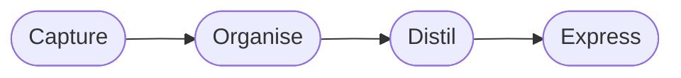

The **default note** (`noteType: note`) is a general-purpose format for essays, technical write-ups, and evergreen knowledge entries. It supports the full Markdown feature set and renders Mermaid diagrams client-side via the `MermaidRenderer` component.

## Headings

Use `##` for major sections — they receive a colored left-border accent from the design system. Avoid `#` in the body; the page title from frontmatter already renders as the single `<h1>`.

## H2 — Major section (left border accent)

### H3 — Sub-section

#### H4 — Minor heading

## Inline Formatting

**Bold text** highlights key terms. _Italic text_ is for titles, foreign words, or softer emphasis. `inline code` marks technical terms, commands, and values. ~~Strikethrough~~ marks deprecated content.

Combining styles: **_bold italic_** is reserved for critical callouts.

## Lists

Unordered list:

- Primary item
- Secondary item
  - Nested item
  - Another nested item
- Tertiary item

Ordered list:

1. First step
2. Second step
   1. Sub-step A
   2. Sub-step B
3. Third step

## Blockquote

> A key insight, quote, or callout goes here.
> Multi-line blockquotes are supported too.

## Code Blocks

With a language identifier (syntax-highlighted):

```bash
#!/bin/bash
echo "Hello, world"
ls -la ./src
```

Plain block (no language, monospace only):

```
key = value
another_key = another_value
```

## Table

| Field        | Type     | Required | Notes                            |
|--------------|----------|----------|----------------------------------|
| `slug`       | string   | ✓        | Must end in `.en` or `.pt-br`    |
| `title`      | string   | ✓        | Shown in card and page header    |
| `publishedAt`| date     | ✓        | ISO 8601 format                  |
| `colorToken` | string   | ✗        | Raw CSS color value              |
| `summary`    | string   | ✗        | Subtitle on page + meta description |

## Horizontal Rule

A `---` creates a visible divider between sections.

---

This is content after the divider.

## Links

[External link](https://example.com) — opens in same tab by default.

[Internal link](/notes) — use root-relative paths for internal navigation.

## Mermaid Diagram

Wrap Mermaid syntax in a fenced block tagged `mermaid`. Renders client-side with tokens from the active theme.



## Frontmatter Reference

```yaml
slug: "my-note.en"              # required — slug.language
title: "My Note Title"          # required
language: "en"                  # required — en | pt-br
translationKey: "my-note"       # required — shared key across translations
publishedAt: "2026-01-01"       # required — ISO date
noteType: note                  # optional — defaults to "note"
summary: "One-line summary."    # optional — subtitle on page + meta description
category: "Engineering"         # optional — controls accent color and card grouping
tags: [tag-a, tag-b]            # optional — shown as monospace pills
colorToken: "#6366f1"           # optional — overrides category accent color
```
