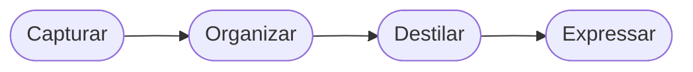

A **nota padrão** (`noteType: note`) é um formato de propósito geral para ensaios, escrita técnica e entradas de conhecimento perene. Suporta o conjunto completo de recursos Markdown e renderiza diagramas Mermaid no cliente via o componente `MermaidRenderer`.

## Títulos

Use `##` para seções principais — elas recebem uma borda esquerda colorida do sistema de design. Evite `#` no corpo; o título da página já vem do frontmatter como único `<h1>`.

## H2 — Seção principal (borda esquerda colorida)

### H3 — Subseção

#### H4 — Subtítulo menor

## Formatação Inline

**Negrito** destaca termos-chave. _Itálico_ é para títulos, palavras estrangeiras ou ênfase mais suave. `código inline` marca termos técnicos, comandos e valores. ~~Tachado~~ marca conteúdo depreciado.

Combinando estilos: **_negrito itálico_** é reservado para destaques críticos.

## Listas

Lista não-ordenada:

- Item primário
- Item secundário
  - Item aninhado
  - Outro item aninhado
- Item terciário

Lista ordenada:

1. Primeiro passo
2. Segundo passo
   1. Subpasso A
   2. Subpasso B
3. Terceiro passo

## Citação em Bloco

> Uma ideia-chave, citação ou destaque fica aqui.
> Citações em bloco com múltiplas linhas também são suportadas.

## Blocos de Código

Com identificador de linguagem (destaque de sintaxe):

```bash
#!/bin/bash
echo "Olá, mundo"
ls -la ./src
```

Bloco simples (sem linguagem, apenas monoespaçado):

```
chave = valor
outra_chave = outro_valor
```

## Tabela

| Campo         | Tipo     | Obrigatório | Notas                                      |
|---------------|----------|-------------|--------------------------------------------|
| `slug`        | string   | ✓           | Deve terminar em `.en` ou `.pt-br`         |
| `title`       | string   | ✓           | Exibido no card e no cabeçalho da página   |
| `publishedAt` | date     | ✓           | Formato ISO 8601                           |
| `colorToken`  | string   | ✗           | Valor de cor CSS diretamente               |
| `summary`     | string   | ✗           | Subtítulo na página + meta description     |

## Régua Horizontal

Um `---` cria um divisor visual entre seções.

---

Este é o conteúdo após o divisor.

## Links

[Link externo](https://exemplo.com) — abre na mesma aba por padrão.

[Link interno](/notes) — use caminhos relativos à raiz para navegação interna.

## Diagrama Mermaid

Envolva a sintaxe Mermaid em um bloco com a tag `mermaid`. Renderiza no cliente com tokens do tema ativo.



## Referência de Frontmatter

```yaml
slug: "minha-nota.pt-br"        # obrigatório — slug.linguagem
title: "Título da Minha Nota"   # obrigatório
language: "pt-br"               # obrigatório — en | pt-br
translationKey: "minha-nota"    # obrigatório — chave compartilhada entre traduções
publishedAt: "2026-01-01"       # obrigatório — data ISO
noteType: note                  # opcional — padrão: "note"
summary: "Resumo em uma linha." # opcional — subtítulo na página + meta description
category: "Engenharia"          # opcional — controla cor de destaque e agrupamento
tags: [tag-a, tag-b]            # opcional — exibidos como pílulas monoespaçadas
colorToken: "#6366f1"           # opcional — sobrescreve a cor de destaque da categoria
```
